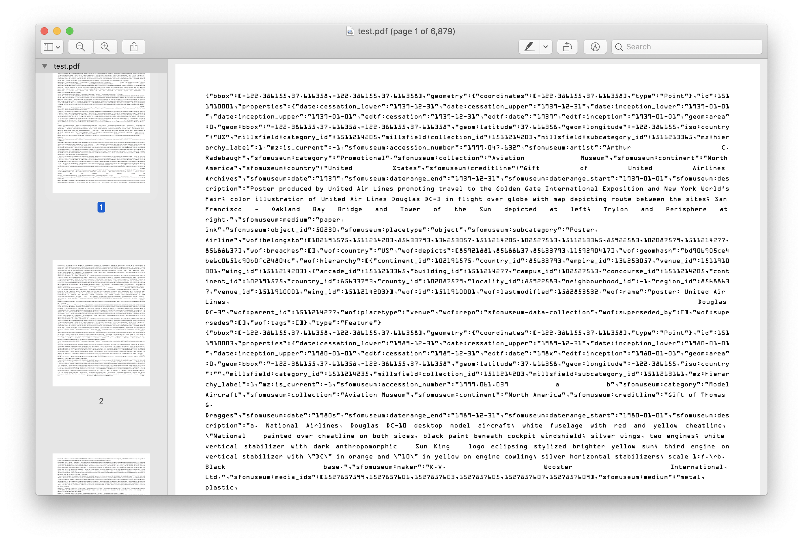

# go-whosonfirst-pdf



Archive one or more Who's On First documents in a PDF file using an OCR-compatible font.

## Important

This is work in progress. It should be considered to work until it doesn't. Patches and other contributions are welcome.

All of the heavy-lifting is done by the [go-archive-pdf](https://github.com/sfomuseum/go-archive-pdf) package.

## Example

_Error handling omitted

### cmd/book/main.go

```
package main

import (
	_ "github.com/whosonfirst/go-whosonfirst-index/fs"
)

import (
	"context"
	"flag"
	"github.com/sfomuseum/go-archive-pdf"
	"github.com/whosonfirst/go-whosonfirst-geojson-v2/feature"
	"github.com/whosonfirst/go-whosonfirst-index"
	"io"
)

func main() {

	mode := flag.String("mode", "repo", "...")

	flag.Parse()

	ctx := context.Background()

	opts := pdf.NewDefaultBookOptions()
	bk, _ := pdf.NewBook(opts)

	cb := func(ctx context.Context, fh io.Reader, args ...interface{}) error {
		f, _ := feature.LoadGeoJSONFeatureFromReader(fh)
		bk.AddRecord(ctx, f.Bytes())
		return nil
	}

	idx, _ := index.NewIndexer(*mode, cb)

	uris := flag.Args()
	idx.Index(ctx, uris...)

	bk.Save("test.pdf")
}
```

## Work in progress

First generate a `test.pdf` file:

```
go run -mod vendor cmd/book/main.go /usr/local/data/sfomuseum-data-collection-classifications/
```

Then use `pdfbox` to pull out images. This is done to mimic scanning the pages of the printed PDF file:

```
java -jar pdfbox-app-2.0.18.jar PDFToImage test.pdf
```

Parse the text of a sample page using `tesseract`:

```
tesseract -l eng test1.jpg out
```

Then try to parse what `tesseract` thinks that text is:

```
> go run cmd/parse/main.go out.txt
2020/03/26 13:59:06 Failed to parse record '{"bbox": [-122.386155,37.616357,-122.386155, 37.616357], "geometry": {"coordinates": [-122.386155,37.616357],"type":"Point"},"id":1511213143,"properties":{"e"uuuu", "edtf:inception":"uuuu", "geom:area":0,"geom:bbox 122.386155, 37.616357, -122.386155,37.616357", "geom: latitude":37.616357, "geom:longitude":-122.386155,"iso:country":"US","mz:hierarchy label":1,"mz:is_ current":-1,"sfomuseum: category": "DA©cor", "sfomuseum:classification_id":2,"sfomuseum:collection":"AviationMuseum", "sfomuseum:placetype": "subcategory", "sfomuseum: subcategory":"Globe","src:geom":"sfomuseum", "wof:belongsto": (1511214249, 102527513,102191575, 85633793,85922583,102087579,1511214277, 1511214203, 85688637], "wof:breaches":[],"wof:country": "US", "wof:geomhash":"30c8a918561c84bb2daa2b97 fc7c5353", "wof:hierarehy": [{"arcade_id":1511213143, "building _id":1511214277,"campus_id":102527513,"concourse_id":1511214249, "continent_id":102191575, "country_id":85633793,"county_id":102087579,"locality_id":85922583,"neighbourhood_id":-1,"region_id"285688637, "wing id":1511214203}],"wof:id":1511213143, "wof:lastmodified":1581718671, "wof:name":"Globe", "wof:parent_id":1511214249, "wof:placetype":"arcade", "wof:repo":"sfomuseum-data-collection-classifications", "wof:superseded_by":[],"wof:supersedes":[],"wof:tags":[]},"type":"Feature"}', invalid character 'u' after object key
2020/03/26 13:59:06 Failed to parse record '{"bbox": [-122.386155,37.616357,-122.386155, 37.616357], "geometry": {"coordinates": [-122.386155,37.616357],"type":"Point"},"id":1511213145,"properties":{"e"uuuu", "edtf:inception":"uuuu", "geom:area":0,"geom:bbox 122.386155, 37.616357,-122.386155,37.616357", "geom: latitude": 37.616357, "geom:longitude":-122.386155,"iso:country":"US","mz:hierarchy label":1,"mz:is_ current":-1,"sfomuseum: category": "Graphics", "sfomuseum:classification_id":3,"sfomu        seum:collection":"AviationMuseum", "sfomuseum:placetype": "category", "src:geom":"sfomuseum", "wof:belongsto": [102527513,102191575, 85633793, 85922583, 102087579, 1511214277, 1511214203,85688637],"wof:breaches":[],"wof:country":"US", "wof:geomhash":"30c8a918561c84bb2daa2b97f£c7c5353", "wof:hierarchy": [{"building_id":1511214277,"campus_id":102527513, "concourse_id":1511213145, "continent_id":102191575, "country _id":85633793,"county_id":102087579, "locality id":85922583,"neighbourhood_id":-1,"region_id":85688637, "wing_id":1511214203}],"wof:i 1511213145,"wof:lastmodified":1581718643, "wof:name":"Graphics", "wof:parent_id":1511214203,"wof:placetype":"concourse", "wof:repo":"sfomuseum-data-collection-classifications","wof:superseded_by":[],"wof:supersedes":[],"wof:tags":[]},"type Feature"}', invalid character 'u' after object key
```

## See also

* https://github.com/sfomuseum/go-archive-pdf